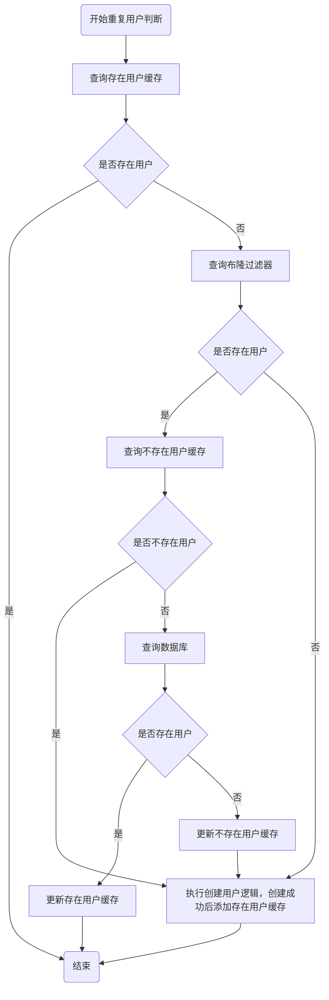

# 编译原理实验系统工程侧说明文档


## 测试说明

### 测试用户

```
用户名
student1
密码
Wp-J*^Co_!

用户名
admin1
密码
V*vz&eh@g@
```

### 函数体

`int getch()`

函数`id` 为3


## 待解决问题

1. innodb引擎在执行物理删除数据时也是逻辑删除（出于事务回滚等原因），即无法立即释放磁盘空间
2. StarCoder2如何接入系统（进行代码优化）
3. 限流（~~防止登录用户频繁调用接口~~ 已解决）（防止未登录的用户频繁请求）
4. 智能问答优化（针对性的回答问题）
5. 第三方代码编译接口的稳定性（如果第三方变更接口）  
6. 用户提交的代码数量限制
7. 使用https进行数据传输（前端使用md5加密密码，易被暴力破解）
8. 添加索引（如用户名）
9. 登录先走缓存
10. 添加账号禁用（频繁登录、频繁发送请求）
11. 告警需求


## 技术方案

### 表结构


**所有表默认带四个字段: `id` `create_time` `update_time` `is_delete`**

#### 配置表结构

配置表，包含词法分析器题截止时间、最后更新人

> 由于配置信息较少，且查询效率要求高，扩展性要求较低
>
> 因此所有配置信息存放在一条记录中

#### 用户表结构

学生、教师、管理员账号密码信息统一存储于用户表，用户表包含账号、密码、角色类型

> 目前角色权限信息存入配置中

学生、教师、管理员分别建表

#### 学生相关表结构

学生表，包含账户id、学生学号、学生姓名、学生所在行政班、学生所在教学班、客观题成绩、函数题成绩、词法分析器成绩

> 成绩都为整数

#### 教师相关表结构

教师表，包含账户id、教师工号、教师姓名、教师所带教学班列表

#### 题目相关表结构

选择题表

填空题表

> 填空题尽量都是些小问题，不要有太长内容，答案不要超过40字

客观题成绩表，包含用户id，选择题题目id列表，填空题题目id列表，选择题答题情况、填空题答题情况、选择题成绩、填空题成绩

词法分析器成绩表，包含用户id、编译器题目id、有得分的最后一次提交代码id、有得分的最高成绩代码id、成绩

词法分析器代码表，包含完整代码、查重代码映射、代码行数

词法分析器题目表，包含编程语言、待编译语言、题目描述、提交数、通过数

词法分词器用例表，包含编译器题目id、终端输入、终端输出

词法分析器查重表，包含词法分析题id、查重代码id、参照代码id、查重率

#### 智能问答相关表结构

> LLM生成过慢，预先存储的数据

智能问答表，包含问题、回答


**函数题暂不维护**


### 缓存

#### 使用场景

用户登录、新建用户

#### 方案与流程图

**虽然用户为名学号，且数据库建立索引查询速度较快，但对于用户名这种较多记录的数据还是做了查询优化**

防止恶意注册同一用户，优先使用存在用户缓存做一次判断，缓存不存在则查询布隆过滤器和数据库

1. 存在用户缓存

   防止重复查询存在的用户，在查询数据库后使用设置过期时间的userName作为缓存

2. 不存在用户缓存

   防止布隆过滤器误判（hash冲突以及值无法删除造成的误判），在布隆过滤器判定中之后都要查询缓存，若缓存不存在则查询数据库，不存在的结果写入缓存

整体逻辑为



#### 缓存占用情况论证

对于存在用户缓存，当重复注册存在用户和注册新用户会添加

对于不存在用户缓存，当布隆过滤器误判时才会添加，且在缓存过期时间内只会误判一次

优先查询的是存在用户缓存，所以不需要主动删除不存在用户缓存

**因此占用率较低**


### 配置

#### 静态配置

##### 权限配置

```yaml
user-role: '{"student":[1000,1001,1002,1003,1004,1005,1006,1008],"teacher":[2000,2001,2002,2003,2004,2005,2006,2008],"admin":[3000,3002,3003,3004,3005,3006,3008]}'
```

#### 动态配置

##### 考试截止时间

截止时间精确度为秒

为了方便修改，词法分析器截止时间信息存在mysql中

当对于词法分析器题目和用例进行修改时，会将截止时间跳到当前时间，即停止作答词法分析器编译


### 定时任务

#### 废弃代码记录清理

> 定时对废弃代码进行清理（物理删除），同时为了避免对其他功能产生较大影响，分批次清理

#### 查重代码映射构建

> 对未构建查重代码映射的代码按成绩顺序分批进行查重代码映射的构建
>
> 同时需要将代码行数入库    **代码行数非映射行数！！！！**


### 限流

IP可能频繁发生变动，因此不采用IP限流策略


后端使用`Nginx`做反向代理，限制`qps`为`50`

特定几个IP不做限流，以保证管理员查看告警信息

>**Tomcat线程池默认信息**
>
>**`maxThreads`**：最大工作线程数，默认值为 200。
>
>**`minSpareThreads`**：最小空闲线程数，默认值为 10。
>
>**`acceptCount`**：当所有的线程都被占用时，允许的最大排队请求数。默认值是 100。

对于不需要鉴权的接口，登录，校验前检查是否为封禁账号，每次登录请求都会进行登录计数自增，当达到阈值时会被封禁一段时间

对于需要鉴权的接口，记录短时间内接口调用次数

在每次触发告警时将频繁访问的账号禁用一段时间（`redis`上设置）


### 重点说明


#### 权限说明

目前一共有三种权限，管理员、教师、学生

学生页面为前台页面

教师和管理员为后台页面

学生可以

1. 修改初始密码，仅一次
2. 查看实验说明
3. 查看并使用函数编译
4. 查看并使用词法分析器编译
5. 查看个人信息


教师可以（教师管理的学生仅限所带教学班的学生）

1. 修改初始密码，仅一次
2. 重置学生密码，无限次
3. 查看**学生信息列表**，修改学生信息
4. 查看和修改函数编译题目列表，更新函数体用例，以及查看**学生完成情况**
5. 查看和修改词法分析题目列表，更新词法分析题用例，以及查看**学生完成情况**
6. 总体查重
>总体查重以教学班为单位
>
>教师可以设置查重率，然后查重
7. 查看和修改配置信息


学生信息列表暂时包括

1. 学号
2. 姓名
3. 教学班级
4. 专业班级
5. 成绩


学生完成情况暂时包括

1. 函数编译题
2. 词法分析题
   1. 代码查重率高的两个学生姓名、学号、教学班、代码、重复代码行
   2. 通过，但行数过少的代码，学生姓名、学号、教学班
   3. 题目通过次数、提交次数、通过率
   4. 通过，但行数过少的


管理员可以

1. 重置学生和教师的账号密码，无限次

2. 新增学生和教师账号

3. 修改学生和教师信息

4. 删除学生和教师（一次性删除账号和信息，以及作答数据，均为逻辑删除）

5. 导出数据（包括学生信息和对应答题信息、题目数据）

6. 清空学生数据（包括学生账户和信息，均为物理删除）

7. 清空教师数据（包括账户和信息，均为物理删除）

8. 清空题目数据（客观题和编程题，均为物理删除）

9. 清空学生作答数据（成绩表、代码表、查重表，均为物理删除）

   > 清空操作目的是在学生结课后删除数据、以免影响服务器性能
   >
   > **清空数据前务必进行导出操作**

10. 查看被禁用的账号用户名


学生信息暂时包括

1. 学号
2. 姓名
3. 专业班级
4. 教学班级
5. 成绩


教师信息暂时包括

1. 教师工号
2. 教师姓名
3. 所带班级


#### 登录

登录，前端存储token，其中携带的信息是登录标识，而不是userId，目的是防止userId泄露

所以光是用户登录，redis中存储了两条信息，一个是登录记录，还有一个是登录信息

```
登录标识：登录信息

userId：登录标识
```

上面一条记录是用于接口鉴权

后面一条记录是用于防止重复登录

其中**存储登录信息的数据**应当先过期，有以下考虑

1. 登录信息和登录记录都过期
   1. 当用户登录时，查询登录记录不存在，先存入登录记录，再存入登录信息
   2. 当用户退出登录时，登录记录不存在，用户认证失败
2. 登录信息过期，登录记录未过期
   1. 当用户登录时，查询登录记录存在，先删除登录信息，登录信息不存在，则无需操作，然后删除登录记录。此后重新进入正常登录的流程
   2. 当用户退出登录时，登录记录存在，先删除登录信息，登录信息不存在，则无需操作，然后删除登录记录。
3. 登录信息和登录记录都未过期
   1. 当用户登录时，查询登录记录存在，先删除登录信息，然后删除登录记录。然后进入正常登录流程
   2. 当用户退出登录时，查询登录记录存在，先删除登录信息，然后删除登录记录。

可以看出查询登录情况是查询登录记录表，而调用接口需要查询登录信息表，那么如果登录记录表先过期，那么无法通过userId删除登录信息，也就是无法进行此前用户的登出操作


**token过期时间为6h**

**登录记录过期时间为5h30min**

**登录信息过期时间为5h**


#### 客观题

选择填空题一次性获取，同时需要获取用户的提交记录

一次校验后不再进行打分，为防止用户作弊，提交记录的查询在后端处理

同时在校验的时候判断是否提交过，也是在后端查询而不是由前端传入

如果是第一次提交，需要将答题情况存入数据库中，其中需要存储选择填空题id，通过`&1klB!` 隔开，选择题存储选项编号，不隔开连续存储，顺序为id的顺序；填空题答题内容存储的是用户答题的内容。

选择题答案字段中，包括标准答案选项和答案内容，如`A有限自动机`

##### 校验

前端传入的题目数量通常是20道，数据库中存储的题库中数据条数不超过1k题,答案内容不超过50字，

总计内容不到1MB，且数据库和后端项目部署于同一机器，网络带宽可以忽略，因此采用一次性获取的模式。

#### 代码提交

用户只能在截止时间前提交的代码

且只能查看有成绩的最后一次提交的代码

代码校验时优先查询redis中数据，存储格式为

```
词法分析器用例标识：{输入用例，输出用例}
```

代码校验后，若有成绩，则将处理后的代码入库，如果比最高成绩还要高，则覆盖最高成绩的代码，以及最高成绩。

> 为了分担后期查重的计算量，在存入代码时将代码进行预处理


#### 代码记录

目前只记录分数最高的代码，存储代码前去掉所有注释和空行 详情参见[代码查重逻辑](####代码查重逻辑)

代码信息包括

1. 提交学生学号
2. 按行分割的代码
3. 使用的语言
4. 题号

数据库中存储的是用户最后一次提交的代码以及第一次提交的分数最高且不为0的代码

用户只能查询截止时间前最后一次提交的代码

有一定时任务清理用户较早提交的（非最高分以及最高分的非第一次提交的）代码


#### 函数代码编译

目前函数代码编译包括四个部分

1. 题目获取
2. 函数选择
3. 代码校验
4. 代码优化


##### 题目获取

目前只支持通过C语言编写PL0程序的词法分析器

题目通过函数标签来区分


##### 函数选择

程序编译的考察为函数体编写，通过给出函数体及提示来编写代码

对于一个函数实现的题目，需要给出的条件如下

1. 题目描述
2. 终端输入
3. 终端输出
4. 函数入参
5. 函数返回值
6. 需要用到的全局变量
7. 需要修改的全局变量
8. 前置函数签名

题目描述必须清楚，详细说明后面6种需要用到的变量用途和函数如何改变这些变量，以及前置函数的用途


##### 代码校验

代码校验同OJ系统，黑盒测试，提供多组用例来预防侥幸过关

```c++
int global1=1,global2=2;

void fun1(int param1);

int fun2(int param1);

int myFun(int input1,int input2){
    // do something...
    //cin>>abab
    //cout<<baba
    return result;
}
```

以上程序牵涉到6种变量以及前置函数，校验方法如下

```c++
// 导入万能库
#include<bits/stdc++.h>
int preFun(int input, int input2){
    //模拟前置函数
}
int global1;
int changedGlobal;
int myFun(int, int);
int main(){
    int output = myFun(111,222);
    //myFun(111,222);
 	// 如果无返回值
    /**
     *
     * 此处的终端输出为测试的函数输出
     *
     */
    // 分隔符
    cout<<"\nfhj……*……*（w4oqqh53fowhgfowhfoa…^hjf￥……oahwgofah\nwjioefhjo\n\n\n\n"；
    cout<<output<<endl;
    // cout<<output.var1<<endl;
    // 或类似的检验方法
    /**
     *
     * 此处的终端输出为函数返回值
     *
     */
    // 分隔符
    cout<<"\nfhj……*……*（w4oqqh53fowhgfowhfoa…^hjf￥……oahwgofah\nwjioefhjo\n\n\n\n"；
    /**
     *
     * 此处的终端输出为全局变量的修改，检验方法同上函数返回值
     *
     */
 
}

```

在能够成功编译的前提下，需要校验的有终端输出、函数返回值、需要修改的全局变量

所以对远程编译器提供输入，将上述代码块与用户代码拼接，然后分别校验上述代码三个模块的输出即可进行代码评估。


对于int getch(); 拼接结果如下

```c++
#include<iostream>
#include<cstdio>
using namespace std;

int getch();
int main(){
    int output = getch();
    cout<<endl;
    cout<<"fhj……*……*（w4oqqh53fowhgfowhfoa…^hjf￥……oahwgofahwjioefhjo"<<endl;
    cout<<output<<endl;
    cout<<"fhj……*……*（w4oqqh53fowhgfowhfoa…^hjf￥……oahwgofahwjioefhjo"<<endl;
}

int getch(void) {
    return getchar();
}
```


#### 代码查重逻辑

以教学班为单位查重，遍历每一个学生


查重逻辑未使用AST，方法较为简易


##### 代码预处理

假如拿到一串代码

```c++
#include<iostream>

#include<cstdio>

using namespace std;

/**
 * main 函数
 *
 */
int main(){
    
    int getchar();
    
    // do something...
    
    return 0;
}
```

首先去除代码所有注释和空行

得到

```c++
#include<iostream>
#include<cstdio>
using namespace std;
int main(){
    int getchar();
    return 0;
}
```

为每行代码标号,以`TEjM536xCG`开头和`hiIHETHAf1` 结尾，中间为行号

```
TEjM536xCG1hiIHETHAf1#include<iostream>
TEjM536xCG2hiIHETHAf1#include<cstdio>
TEjM536xCG3hiIHETHAf1using namespace std;
TEjM536xCGh4iIHETHAf1int main(){
TEjM536xCGh5iIHETHAf1    int getchar();
TEjM536xCGh6iIHETHAf1    return 0;
TEjM536xCGh7iIHETHAf1}
```

在数据库中，代码存储格式为字符串，以上代码存储结果

```
TEjM536xCG1hiIHETHAf1#include<iostream>TEjM536xCG2hiIHETHAf1#include<cstdio>TEjM536xCG3hiIHETHAf1using namespace std;TEjM536xCGh4iIHETHAf1int main(){TEjM536xCGh5iIHETHAf1    int getchar();TEjM536xCGh6iIHETHAf1    return 0;TEjM536xCGh7iIHETHAf1}
```

以上为代码存储方式

---

在Java中，字符串和标号通过Map存储`Map<Integer,String>` 以致不弄丢字符串的编号

随后

1. 将只存在`,;'"}{)(` 的行全部从Map中移除
2. 将所有变量名，包括函数名，库文件名全部替换为var，但保留关键字和运算符等
3. 将除了花括号的每一行的代码字符串转化为hash(通过`md5` 16位小写，即16^16，可能性足够区分代码 即使在不同机器上，相同字符串的hash也是一样的)，替换原来的代码字符串

```
#include<var>
#include<var>
usingnamespacestd;
intvar(){
intvar();
return0;
```

通过md5散列后

```
dba7d3f9c3453c12
dba7d3f9c3453c12
30070f119ed5a9fd
d935e4a352dbb21e
314c6ac65bc8ffc6
277e7e114796d8bd
```

由于md5后只存在16进制位数，可以用`q`和`p`作为分隔符

```
q1pdba7d3f9c3453c12
q2pdba7d3f9c3453c12
q3p30070f119ed5a9fd
q4pd935e4a352dbb21e
q5p314c6ac65bc8ffc6
q6p277e7e114796d8bd
```

存入数据库中

```
q1pdba7d3f9c3453c12q2pdba7d3f9c3453c12q3p30070f119ed5a9fdq4pd935e4a352dbb21eq5p314c6ac65bc8ffc6q6p277e7e114796d8bd
```


##### 查重逻辑论证

由于去掉了所有空行和注释以及无意义行，提高了查重命中率

查重代码和参照代码不可逆，因为

- 查重者和参照者的查重率是不同的
- 如果有学生抄袭代码后故意增添无意义代码，查重代码查重率会降低，但参照者依然很高，一比对就能知道谁是抄袭者，如果参照者能“预知”到自己的代码被抄袭而提前修改提交的代码，那就另当别论了~~~

由于本查重方法是以行为单位查重代码，所以如果用户将两行代码压缩为一行，会影响查重率，因此做了兜底策略，即记录用户代码行数，若过少，则为异常代码。如果用户压缩的行数过多则可能为异常代码，如果过少则查重率显著

##### 开始查重


1. 遍历每个教学班、教学班的每个学生
2. 全连接映射的形式比对，例如，有学生1 2 3，需要比对1和2，1和3，2和1，2和3，3和1，3和2
3. 去除比对同学的最高分代码映射存入set
4. 两个set取交集，`重复行数/总行数`超过指定比例即为疑似重复
5. 将重复代码id和查重率存入数据库，无需持久化具体重复代码


```java
// 参考代码，待验证


import java.util.regex.*;
import java.security.MessageDigest;
import java.security.NoSuchAlgorithmException;
import java.util.*;

public class CodeDeobfuscator {

    // 去除单行注释
    private static String removeSingleLineComments(String code) {
        return code.replaceAll("//.*", "");
    }

    // 去除多行注释
    private static String removeMultiLineComments(String code) {
        return code.replaceAll("/\\*.*?\\*/", "", Pattern.DOTALL);
    }

    // 替换变量名和函数名为 'var'
    private static String replaceIdentifiers(String code) {
        // 仅替换变量名和函数名（不影响关键字）
        code = code.replaceAll("\\b([a-zA-Z_][a-zA-Z0-9_]*)\\b", "var");
        return code;
    }

    // 移除多余空格
    private static String removeWhitespace(String code) {
        return code.replaceAll("\\s+", "");
    }

    // 计算字符串的 MD5 哈希值
    private static String computeHash(String input) {
        try {
            MessageDigest md = MessageDigest.getInstance("MD5");
            byte[] messageDigest = md.digest(input.getBytes());
            StringBuilder sb = new StringBuilder();
            for (byte b : messageDigest) {
                sb.append(String.format("%02x", b));
            }
            return sb.toString();
        } catch (NoSuchAlgorithmException e) {
            e.printStackTrace();
            return null;
        }
    }

    // 处理代码
    public static Set<String> processCode(String code) {
        Set<String> hashes = new HashSet<>();
        String[] lines = code.split("\n");

        for (String line : lines) {
            // 移除注释和空白
            String normalizedCode = removeSingleLineComments(line);
            normalizedCode = removeMultiLineComments(normalizedCode);
            normalizedCode = removeWhitespace(normalizedCode);

            // 替换变量名和函数名
            normalizedCode = replaceIdentifiers(normalizedCode);

            // 如果代码行不是空的，计算它的哈希值
            if (!normalizedCode.isEmpty()) {
                String hash = computeHash(normalizedCode);
                hashes.add(hash); // 将哈希值存入集合
            }
        }

        return hashes;
    }

    public static void main(String[] args) {
        // 示例代码
        String code = "int main() {\n    int x = 10;\n    // Variable assignment\n    x = x + 2;\n    return x;\n}";

        // 处理代码并获取哈希值
        Set<String> hashes = processCode(code);

        // 输出哈希值
        System.out.println("代码片段的哈希值:");
        for (String hash : hashes) {
            System.out.println(hash);
        }
    }
}
```


只记录一个用户第一次ac的代码


#### 代码编译

目前采用的是远程代码编译器，为防止远程编译接口失效，尝试本地部署编译服务

准备一个包含`gcc`的镜像，每次执行用户代码都通过创建容器进行，从而将用户的代码的执行隔离

对于容器的创建和销毁可以使用`K8s`进行管理，同时注意资源和权限的限制，以免影响到其他服务


#### 题目变更

##### 词法分析题变更

当教师更新词法分析题用例时，同步更新redis中测试用例，配置中截止时间会设置为当前时间，更新结束后，设置回原来时间


#### 学生教师信息管理

目前包括单个学生或老师添加，在信息添加的同时也会创建对应的用户

用户名为学生学号或老师工号

##### 账号导入


## 部署


## 草稿


```c++
#include<iostream>
#include<string>
using namespace std;
int main(){

string a;
while(cin>>a);

string str = "const  基本字\na      标识符\n=     运算符\n10	数字\n；    界符\n     var    基本字\nb      标识符\n，   界符\nc      标识符\n；    界符\n学号   基本字\n：     非法\n201812345 数字\n姓名  基本字\n：     非法\n张三  基本字\nend    基本字\n.     界符";
cout<<str;
return 0;
}
```


